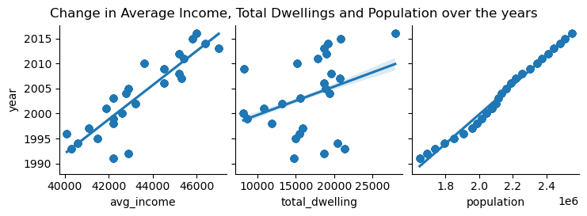

# Group 13 final report

## Introduction
Kristina and Gaurang are international students currently residing and attending university in Canada. When we first arrived, we talked about how we were both surprised by the housing and rent prices because compared to our home countries, they were not only unreasonably high, but you had to overpay for what you were getting. This was true not just in the metropolitan area but also in Canada's more remote regions. Michael had a very similar outlook as he's from Canada and is aware of the housing situation here. We chose to analyse this dataset because it is a great opportunity to learn more about Canada's housing and rental markets, comprehend the variables that influence rent and home prices, and identify any other correlations that might exist within particular regions. Additionally, this analysis may one day be helpful for other international and domestic students who are paying rent in Canada or for people seeking to buy their first home
## Exploratory Data Analysis

#### Comments
Here, we're able to see how many new dwellings (places to live) have their construction started on a year-by-year and region-by-region basis. This is a great way to get insight on the situation of the housing market across the years

#### Comments
This bar graph gives us an understanding of the trend Average Income has followed in Vancouver. It has been rising consistently for quite a while now - but does not seem to follow the trends of HPI. Further analysis is needed but this is a good overview of its progression over the years.

#### Comments
We can see the general trend of the Housing Price Index scores, Canada wide, over the last 40 years. Overall, Canada's HPI score has increased significantly, but not smoothly. By looking at the trends of other variables, like population, we can see what does and what doesn't have notable influence over HPI scores in Canada.

#### Comments
After some processing, we'll return to this chart, but for now we can see right away that the population in each region of Canada has increased quite linearly - very different from how HPI has changed overall. 

### Research Question 1 + Results:
Question: How has Income Distribution and Population impacted housing prices in Vancouver?

#### Comments
From this heatmap, it looks like the total HPI is heavily influenced by Completed houses and Total Dwellings, both of which are very similar. The next highest influence was by Aggregate Income, followed by Population. This was somewhat expected, but I was hoping for stronger correlations. From this, it looks like all of the above mentioned factors play a fairly important role in resulting HPI. We can plot these individually and have a look at how they correlate even further.

#### Comments
A few things jump out at first glance when looking at this visualisation. The graphs for Population and Average Income seem to be relatively similar, but Total Dwellings seem to be following a different pattern. As all 3 are contributing factors, it's valuable to try and find why this is the case. Total dwellings had the highest correlation with HPI out of all these 3 columns - so its values is quite important.

#### Comments
Very interesting! This explains a lot. Average income and Population have been increasing steadily and quite steeply since 1990, but the total amount of houses being constructed has not been keeping up. This shows us the potential discrepancy in Supply and Demand - the demand for housing has continued to go up due to the steady rise in population, but the supply has not been keeping up. And, as average income has been rising, the housing market has been able to steadily increase prices too.

### Research Question 2 + Results:

### Research Question 3 + Results:
Question: How do changes in population affect the Housing Price Index across Canada?

#### Comments
Here is the chart of populations by region over the years after a little touching-up. I'll be using this in comparisons with HPI scores by regions, to see if the population and HPI changes are similar, or if perhaps I am wrong and the population of a region does not strongly affect that region's HPI.

#### Comments
First, I took a look at Ontario. While the HPI scores in Ontario have increased overall, there have been dips and plateaus that are not seen in our population data for the region. Beyond that, the increase in HPI is far steeper - the lines have almost nothing in common. With a steady increase in population but variable changes in HPI in Ontario, it's unlikely that population is a primary driver of HPI values here. 

#### Comments
To compare with Ontario, I wanted to take a look at Prince Edward Island and the HPI trend there, as it is a very different region from Ontario. We can see that the trend in Prince Edward Island has been quite different from the trend in Ontario, although similar in the last few (exceptional!) years. However, if we take a look at the population trends for these regions, we see that they are both stable and linear. This is not what I expected to see!

## Summary/Conclusion
#### Research Question 1: 
How has Income Distribution and Population impacted housing prices in Vancouver?

#### Conclusion: 
From the analysis, we were able to see the discrepancy that exists with the Supply and Demand of housing in Vancouver. This would naturally cause an increase in the housing market. Alongside that, we see the steady increase in average income. This shows us that while the prices have gone up - so has the average income, explaining why the HPI has continued to rise - the population has been able to keep up with the pricing. One solution to this is fairly obvious - if there was an increase in total dwellings, enough to get closer to the growth of population, the HPI would be more under control. While there are multiple other factors influencing HPI that cannot be determined through this dataset as its quite a complex calculation - fixing the gap between supply and demand is a good start to fixing the housing prices.

#### Research Question 3:
How do changes in population affect the Housing Price Index across Canada?

#### Conclusion:
After comparing the population changes with the HPI changes for different regions across Canada, as well as comparing the HPI changes across regions to each other, I can see that my hypothesis was wrong. While I thought that population changes in a region would be directly reflected in the HPI trend for that region, it appears as though that is untrue. With a steady population but variable changes in HPI, population can't be a main driver - and beyond that, the HPI changes differ between ranges. For example, scores in P.E.I. plateaued between 2010 and 2015, but increased in Ontario during that same period. This suggests that the main variables responsible for affecting HPI scores are regional, once again ruling out population as population has steadily increased across all regions in Canada. This is still useful however, as now we know not to worry about population changes as we look for solutions to the unreasonable housing prices here in Canada.
