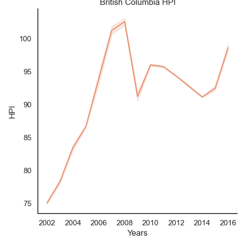

# Group 13 final report

## Introduction
Kristina and Gaurang are international students currently residing and attending university in Canada. When we first arrived, we talked about how we were both surprised by the housing and rent prices because compared to our home countries, they were not only unreasonably high, but you had to overpay for what you were getting. This was true not just in the metropolitan area but also in Canada's more remote regions. Michael had a very similar outlook as he's from Canada and is aware of the housing situation here. We chose to analyse this dataset because it is a great opportunity to learn more about Canada's housing and rental markets, comprehend the variables that influence rent and home prices, and identify any other correlations that might exist within particular regions. Additionally, this analysis may one day be helpful for other international and domestic students who are paying rent in Canada or for people seeking to buy their first home
## Exploratory Data Analysis

#### Comments
Here, we're able to see how many new dwellings (places to live) have their construction started on a year-by-year and region-by-region basis. This is a great way to get insight on the situation of the housing market across the years

#### Comments
This bar graph gives us an understanding of the trend Average Income has followed in Vancouver. It has been rising consistently for quite a while now - but does not seem to follow the trends of HPI. Further analysis is needed but this is a good overview of its progression over the years.

### Research Question 1 + Results:
Question: How has Income Distribution and Population impacted housing prices in Vancouver?

#### Comments
From this heatmap, it looks like the total HPI is heavily influenced by Completed houses and Total Dwellings, both of which are very similar. The next highest influence was by Aggregate Income, followed by Population. This was somewhat expected, but I was hoping for stronger correlations. From this, it looks like all of the above mentioned factors play a fairly important role in resulting HPI. We can plot these individually and have a look at how they correlate even further.

#### Comments
A few things jump out at first glance when looking at this visualisation. The graphs for Population and Average Income seem to be relatively similar, but Total Dwellings seem to be following a different pattern. As all 3 are contributing factors, it's valuable to try and find why this is the case. Total dwellings had the highest correlation with HPI out of all these 3 columns - so its values is quite important.

#### Comments
Very interesting! This explains a lot. Average income and Population have been increasing steadily and quite steeply since 1990, but the total amount of houses being constructed has not been keeping up. This shows us the potential discrepancy in Supply and Demand - the demand for housing has continued to go up due to the steady rise in population, but the supply has not been keeping up. And, as average income has been rising, the housing market has been able to steadily increase prices too.

### Research Question 2 + Results:
Question: What is the impact of growing population in BC on the house prices and rental market in British Columbia?

1. Visualization:

#### Comments:
My research question is exploring whether the growing population in British Columbia is affecting house prices and the rental market. I used three datasets in my research: the population in Canada across regions, the BC house price index and the rental vacancy rate percentage. 

This initial visualization is crucial because I had to demonstrate that British Columbia's population has grown over the past 20 years. This virtualization is significant to my research because it establishes the conceptual foundation for how British Columbia's population has grown over the past 20 years. This graph frequently shows data overlap, which is expected given that the data also demonstrates how the population has grown within that particular year. Nevertheless, the overall regression line indicates that all of these increases contributed to the growth of the population as a whole throughout time. Now that this has been established, it is time to examine how British Columbia's expanding population affects housing prices and the rental market.

2. Visualization:

#### Comments:
The graph of the rental vacancy rate percentages over the past 20 years and their count is the second crucial data visualization I used for this analysis to address the research question. I decided to use the vacancy rate and determine its count to determine the most common types of vacancy rates in British Columbia. In essence, I sought to determine which vacancy rate in British Columbia during the previous 20 years had been the most prevalent. A 2–4% vacancy rate in large cities is considered acceptable, although lower percentages indicate fewer rental spaces are available. According to this graph, the overall vacancy rate in British Columbia is 2.4%, which is reasonable. However, a short while afterwards, the vacancy rate is frequently at 1.2%, 1%, and 2.7%. This implies that over the past 20 years, the vacancy rate in British Columbia has likewise been regularly at a less desirable and unhealthy rate. There also have been over forty counts of the vacancy rate to be 1.3%, meaning there is a very low vacancy rate and very few properties are available to rent.

3. Visualization:

#### Comments:
This is my third visualization; as you can see, British Columbia's population has been growing steadily throughout the years. Similarly, it is clear that the HPI has increased in BC over time. However, this graph demonstrates that while the HPI did not grow as quickly as the population, it did so nonetheless. This is also supported in the next visualization 4.

4. Visualization:

#### Comments:
I chose to look at the HPI because it is a more accurate representation of housing prices. The HPI is a measure of real estate prices that provides a clearer picture of market trends than traditional tools like the mean or median average prices. So, I decided to use this to see how population growth affects the house price market in BC. As we have seen in the previous graphs, population growth in BC is fairly stable as it has gone up over the years. On the other hand, the HIP is not as stable, and as the population in a province like British Columbia has increased, so has the house price index because more people want to buy houses. Higher demand means higher prices. On the other hand, the HPI is not always stable, and there are ups and downs over the years as it increases, which leads me to believe that there must be other attributes affecting HPI other than population growth.

5. Visualization:

#### Comments:
Here is my last visualization 5, and I wanted to see all the data side by side to conclude the analysis. Here I can also see the vacancy rate together with other population data and HPI data. Looking at the 'vacancy rate data, ' we can see that 3.1%, which is good for people because that means that there are a lot of properties for them available to rent, was really only in the early 2000s. As the population increased, we can see that the vacancy rate decreased, resulting in less property available to rent. In fact, the most recent data was 1.3% which is really low. This confirms my hypothesis that as the population increases and the price of buying a house goes up, more people are renting, which leads to a lower rent vacancy rate. However, this particular data goes up and down over the years despite generally being higher, like 3.1% and 2.4%, in the past and lower in more recent years, 1.5% and 1.3%. But we can also see that some data went back showing that there were some increases in the vacancy rate in the more recent years, for example, 2.4% appeared in the year 2012 and 2.7% in 2015. Suggesting that both HPI and Vacancy Rate in BC are affected by population growth, but also, there must be some other factors that make them go up and down other than the population growth in BC, which has been steadily increasing over the years.

### Research Question 3 + Results:

## Summary/Conclusion
#### Research Question 1: 
How has Income Distribution and Population impacted housing prices in Vancouver?

#### Conclusion: 
From the analysis, we were able to see the discrepancy that exists with the Supply and Demand of housing in Vancouver. This would naturally cause an increase in the housing market. Alongside that, we see the steady increase in average income. This shows us that while the prices have gone up - so has the average income, explaining why the HPI has continued to rise - the population has been able to keep up with the pricing. One solution to this is fairly obvious - if there was an increase in total dwellings, enough to get closer to the growth of population, the HPI would be more under control. While there are multiple other factors influencing HPI that cannot be determined through this dataset as its quite a complex calculation - fixing the gap between supply and demand is a good start to fixing the housing prices.

#### Research Question 2: 
Question: What is the impact of growing population in BC on the house prices and rental market in British Columbia?

#### Conclusion: 
While looking at my data, the common trend is that the factors like  'population' and 'HPI' have increased in British Columbia in the last 20 years, and as I suspected, the 'rental vacancy rate' has decreased over the years. 

According to the graphs, population growth is fairly stable as it goes up over the years. On the other hand, the HIP is not as stable, and as the population in a province like British Columbia has increased, so has the house price index because more people want to buy houses. Higher demand means higher prices. On the other hand, the HPI is not always stable, and there are ups and downs over the years as it increases, which leads me to believe that there must be other facts affecting HPI other than population growth. 

As for the 'vacancy rate', I assumed that the higher the house prices and the higher the population, the lower the vacancy rate because, with high house prices, people would rent more and buy less.  

However, looking at the data for the 'vacancy rate', the rate is low overall or at least in the last few years. This confirms my hypothesis that as the population increases and the price of buying a house goes up, more people are renting, which leads to a lower rent vacancy rate. However, this particular data goes up and down over the years despite generally being higher in the past and lower in more recent years.

This leads me to conclude that my answer is yes to my research question of whether the population impacts house prices and the rental market. But when it comes to these two variables, other forces are at play, which sometimes changes HIP and rental vacancy rate values throughout the years, making them go up and down.

This could explain what happened during COVID-19 when the mortgage interest rates were lowered, causing house prices to go down, despite the increasing population, and more people were buying a house rather than renting. Or how many people moved from rental properties to live at home with families increasing the rental vacancy rate.